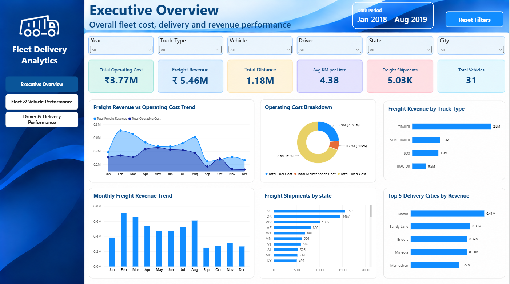
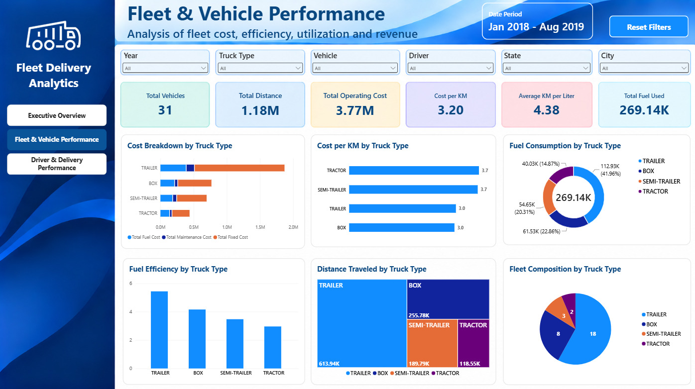
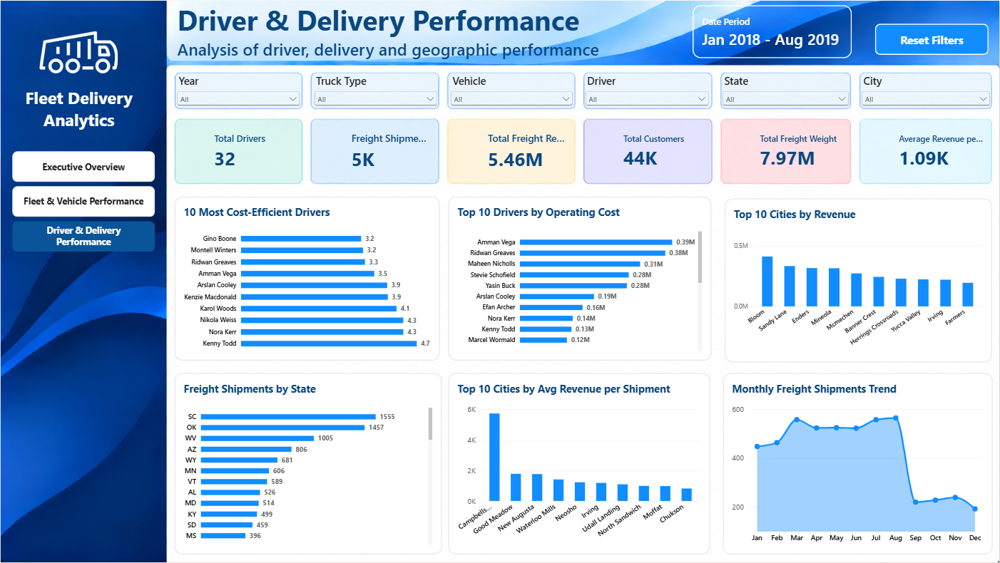

# 🚚 Fleet Delivery Performance Analytics

> **End-to-end data analytics pipeline for fleet, delivery, cost, and revenue performance — from Python ETL and SQL Server to an interactive Power BI dashboard.**

---

## 🌐 Live Power BI Report

**[View the published Fleet Delivery Performance Analytics report](https://app.powerbi.com/groups/0a334a76-91ec-49cf-93ab-6def0cdbad56/reports/3d944293-2a9d-4bfc-8e05-f22c46695212/d30f811b0be04689e99b?experience=power-bi&bookmarkGuid=078d2882923200d30372)**

> The report is published to Power BI Service. Interactive filters can be used to explore the three dashboard pages.

---

## 📌 Project Overview

This project analyzes fleet delivery operations using a complete analytics workflow:

**Raw Kaggle Data → Python ETL → SQL Server → SQL Analysis → Power BI**

The project focuses on understanding:

- 🚚 Fleet and vehicle performance
- 👨‍✈️ Driver efficiency and operating cost
- 💰 Freight revenue and operating costs
- ⛽ Fuel consumption and efficiency
- 📦 Freight shipments and delivery activity
- 🗺️ Geographic performance by state and city

The goal is to transform messy operational data into a structured analytical model and an interactive Power BI report that can be used to explore fleet and delivery performance.

---

## 🏗️ Solution Architecture

```text
Kaggle Dataset
      │
      ▼
Python + Pandas
      │
      │  Extract, clean, validate,
      │  standardize and export
      ▼
Clean CSV Files
      │
      ▼
SQL Server
      │
      │  Relationships, JOINs,
      │  GROUP BY, CTEs,
      │  window functions and analysis
      ▼
Power BI
      │
      ├── Data Model
      ├── DAX Measures
      └── Interactive Dashboards
```

---

## 📂 Project Structure

```text
Fleet-Delivery-Performance-Analytics/
│
├── data/
│   ├── raw/
│   │   ├── DimensionTables.xlsx
│   │   ├── fCosts.xlsx
│   │   └── fFreight.csv
│   │
│   └── clean/
│       ├── customers.csv
│       ├── drivers.csv
│       ├── vehicles.csv
│       ├── freight.csv
│       └── costs.csv
│
├── images/
│   ├── page1_executive_overview.png
│   ├── page2_fleet_vehicle_performance.png
│   └── page3_driver_delivery_performance.png
│
├── ETL Delivery Truck - Structured.ipynb
├── README.md
└── .gitignore
```

> The Power BI `.pbix` file is excluded from GitHub through `.gitignore`. The report was developed in Power BI Desktop using the SQL Server model.

---

# 🔄 Data Pipeline

## 1. 📥 Data Extraction

The source dataset was downloaded from Kaggle using the Kaggle API.

### Source files

| File | Format | Purpose |
|---|---|---|
| `DimensionTables.xlsx` | Excel | Driver, vehicle, and customer dimension data |
| `fCosts.xlsx` | Excel | Fleet operating cost records |
| `fFreight.csv` | CSV | Freight and delivery transaction records |

---

## 2. 🧹 Data Cleaning & Transformation

Python and Pandas were used to convert the raw files into analysis-ready datasets.

### Key ETL steps

- Loaded Excel and CSV source files
- Inspected table structures and column types
- Validated primary identifiers
- Separated and standardized dimension tables
- Cleaned the multi-year cost workbook
- Removed non-data/separator rows from the cost data
- Converted dates to proper date format
- Converted numeric fields to appropriate numeric types
- Cleaned freight numeric values and decimal formatting
- Standardized column names
- Performed duplicate and data-quality checks
- Exported five clean CSV datasets

### Final clean datasets

| Table | Rows |
|---|---:|
| `drivers` | 32 |
| `vehicles` | 31 |
| `customers` | 43,910 |
| `costs` | 295 |
| `freight` | 92,060 |

---

# 🗄️ SQL Server Database

The cleaned CSV files were imported into a **Microsoft SQL Server** database named:

```text
FleetDeliveryAnalytics
```

SQL Server was used as the relational storage and analysis layer between Python ETL and Power BI.

## Database tables

```text
drivers
vehicles
customers
costs
freight
```

### Key relationships

```text
drivers
   │
   └──────────< costs >──────────┐
                                  │
vehicles ────────────────────────┘
   │
   └──────────< freight >────────── customers
```

### Primary keys

- `drivers.driver_id`
- `vehicles.truck_id`
- `customers.customer_id`

### Foreign keys

- `costs.driver_id → drivers.driver_id`
- `costs.truck_id → vehicles.truck_id`
- `freight.truck_id → vehicles.truck_id`
- `freight.customer_id → customers.customer_id`

---

# 🧮 SQL Analysis

SQL was used after loading the cleaned data into SQL Server to perform relational analysis and derive operational metrics.

### SQL concepts demonstrated

- `SELECT`
- `WHERE`
- `JOIN`
- `LEFT JOIN`
- `GROUP BY`
- Aggregations
- `CASE`
- CTEs
- `RANK()`
- `ROW_NUMBER()`
- Derived metrics

### Examples of calculated metrics

**Total Operating Cost**

```text
Fuel Cost + Maintenance Cost + Fixed Cost
```

**KM per Liter**

```text
Distance Traveled / Fuel Used
```

**Cost per KM**

```text
Total Operating Cost / Distance Traveled
```

**Revenue per KG**

```text
Freight Revenue / Freight Weight
```

These calculations were used to analyze driver, vehicle, freight, and truck-type performance.

---

# 📊 Power BI Dashboard

The final Power BI report contains **three analytical pages**, with shared filters for Year, Truck Type, Vehicle, Driver, State, and City.

### 🔗 Published Report

**[Open the interactive Power BI report](https://app.powerbi.com/groups/0a334a76-91ec-49cf-93ab-6def0cdbad56/reports/3d944293-2a9d-4bfc-8e05-f22c46695212/d30f811b0be04689e99b?experience=power-bi&bookmarkGuid=078d2882923200d30372)**

---

## 1. Executive Overview

Provides a high-level view of fleet cost, freight revenue, distance, fuel efficiency, shipment activity, and vehicle count.

### KPI metrics

- Total Operating Cost
- Freight Revenue
- Total Distance
- Average KM per Liter
- Freight Shipments
- Total Vehicles

### Main visuals

- Freight Revenue vs Operating Cost Trend
- Operating Cost Breakdown
- Freight Revenue by Truck Type
- Monthly Freight Revenue Trend
- Freight Shipments by State
- Top 5 Delivery Cities by Revenue

### Dashboard Preview



---

## 2. Fleet & Vehicle Performance

Focuses on fleet composition, operating efficiency, cost, fuel usage, and distance.

### KPI metrics

- Total Vehicles
- Total Distance
- Total Operating Cost
- Cost per KM
- Average KM per Liter
- Total Fuel Used

### Main visuals

- Cost Breakdown by Truck Type
- Cost per KM by Truck Type
- Fuel Consumption by Truck Type
- Fuel Efficiency by Truck Type
- Distance Traveled by Truck Type
- Fleet Composition by Truck Type

### Dashboard Preview



---

## 3. Driver & Delivery Performance

Focuses on driver efficiency, operating costs, freight activity, and geographic delivery performance.

### KPI metrics

- Total Drivers
- Freight Shipments
- Total Freight Revenue
- Total Customers
- Total Freight Weight
- Average Revenue per Shipment

### Main visuals

- 10 Most Cost-Efficient Drivers
- Top 10 Drivers by Operating Cost
- Top 10 Cities by Revenue
- Freight Shipments by State
- Top 10 Cities by Average Revenue per Shipment
- Monthly Freight Shipments Trend

### Dashboard Preview



---

# 📅 Date Modeling

A dedicated `DateTable` was created in Power BI to provide a common date dimension for the `freight` and `costs` tables.

The table contains:

- Date
- Year
- Month
- Month Number

The month name is sorted using the month number to maintain chronological order.

This allows the report to use consistent time filtering and monthly trends across different fact tables.

---

# 📐 Power BI Data Model

The Power BI model uses a relationship-based structure rather than combining all data into one large table.

```text
                 DateTable
                 /       \
                /         \
               ▼           ▼
           freight       costs
             ▲  ▲         ▲  ▲
             │  │         │  │
             │  └─────────┘  │
             │               │
        customers          drivers
             │
             │
          vehicles
             │
             └──────── freight
```

Key relationships include:

```text
DateTable[Date] → freight[date]
DateTable[Date] → costs[date]

customers[customer_id] → freight[customer_id]
vehicles[truck_id] → freight[truck_id]
vehicles[truck_id] → costs[truck_id]
drivers[driver_id] → costs[driver_id]
```

---

# 🧮 Key DAX Measures

The Power BI report uses measures for reusable business calculations.

### Total Operating Cost

```DAX
Total Operating Cost =
SUM(costs[fuel])
    + SUM(costs[maintenance])
    + SUM(costs[fixed_costs])
```

### Total Distance

```DAX
Total Distance =
SUM(costs[km_traveled])
```

### Average KM per Liter

```DAX
Average KM per Liter =
DIVIDE(
    [Total Distance],
    [Total Fuel Used]
)
```

### Cost per KM

```DAX
Cost per KM =
DIVIDE(
    [Total Operating Cost],
    [Total Distance]
)
```

### Total Freight Revenue

```DAX
Total Freight Revenue =
SUM(freight[net_revenue])
```

### Freight Shipments

```DAX
Freight Shipments =
DISTINCTCOUNT(freight[freight_id])
```

### Total Vehicles

```DAX
Total Vehicles =
DISTINCTCOUNT(vehicles[truck_id])
```

Additional measures are used for fuel, maintenance, fixed costs, freight weight, goods value, drivers, customers, and revenue-per-shipment analysis.

---

# 🔍 Business Questions

The project is designed to answer questions such as:

### Fleet & Cost
- Which truck types generate the highest operating cost?
- Which truck types have the lowest cost per KM?
- How is operating cost divided between fuel, maintenance, and fixed costs?
- How much distance is being covered by each truck type?

### Fuel & Efficiency
- Which truck types have higher fuel consumption?
- How does fuel efficiency vary by truck type?
- What is the overall KM-per-liter performance?

### Driver Performance
- Which drivers have the lowest cost per KM?
- Which drivers have the highest operating cost?
- How does driver performance vary across the fleet?

### Delivery & Revenue
- Which truck types generate the most freight revenue?
- Which states have the highest shipment volumes?
- Which cities generate the highest freight revenue?
- Which cities have the highest average revenue per shipment?
- How does freight revenue change month by month?

---

# 💡 Key Analytical Findings

The dashboard provides a way to identify:

- Differences in operating cost across truck types
- Differences in fuel efficiency across the fleet
- Drivers with relatively lower or higher cost per KM
- Geographic differences in shipment activity
- High-revenue delivery cities
- Monthly changes in freight revenue and shipment volume
- Fleet composition across truck types

> **Note:** Specific rankings and values shown in the dashboard are dynamic and change when Year, Truck Type, Vehicle, Driver, State, or City filters are applied.

---

# 🛠️ Tech Stack

| Layer | Technology |
|---|---|
| Data Source | Kaggle |
| Data Extraction | Python · Kaggle API |
| ETL | Python · Pandas · Jupyter Notebook |
| Database | Microsoft SQL Server |
| SQL Analysis | SQL Server · T-SQL |
| BI & Visualization | Microsoft Power BI |
| Version Control | Git · GitHub |

---

# 🚀 Getting Started

## Prerequisites

- Python 3.8+
- Microsoft SQL Server
- SQL Server Management Studio (SSMS)
- Power BI Desktop
- Kaggle API credentials

## 1. Clone the repository

```bash
git clone https://github.com/bhu1421/Fleet-Delivery-Performance-Analytics.git
cd Fleet-Delivery-Performance-Analytics
```

## 2. Install Python dependencies

```bash
pip install pandas sqlalchemy openpyxl kaggle jupyter
```

> If the notebook uses additional packages, install them according to the notebook's import section.

## 3. Run the ETL notebook

```bash
jupyter notebook "ETL Delivery Truck - Structured.ipynb"
```

The notebook extracts the source data, cleans and validates it, and produces the files in:

```text
data/clean/
```

## 4. Load the clean CSV files into SQL Server

Create a database:

```sql
CREATE DATABASE FleetDeliveryAnalytics;
```

Import the five cleaned CSV files into:

```text
drivers
vehicles
customers
costs
freight
```

Then create the required primary-key and foreign-key relationships.

## 5. Connect Power BI

Open the Power BI report in Power BI Desktop and connect it to:

```text
Database: FleetDeliveryAnalytics
Server: localhost
```

Update the connection if SQL Server is running on a different server or instance.

---

# 📌 Data Quality & Validation

The ETL workflow includes checks for:

- Row counts
- Column names
- Data types
- Missing values
- Identifier consistency
- Numeric conversion
- Date conversion
- Duplicate records
- Foreign-key compatibility

Final clean-table row counts are validated before the data is used for SQL and Power BI analysis.

---

# 📁 Repository Notes

The repository keeps the original raw source files and the cleaned analytical datasets so the transformation process can be inspected and reproduced.

Large or temporary files such as:

```text
*.pbix
logistics-fleet-data.zip
__pycache__/
.ipynb_checkpoints/
```

are excluded through `.gitignore`.

The `images/` directory contains the three dashboard screenshots embedded in this README.

---

# 🎯 Skills Demonstrated

This project demonstrates practical experience with:

- Data extraction
- Data cleaning
- ETL pipeline development
- Pandas
- SQL Server
- Relational data modeling
- SQL JOINs and aggregations
- CTEs and window functions
- Data validation
- Power BI data modeling
- DAX measures
- Interactive dashboard design
- Business-oriented data analysis

---

## 📄 License

This project is created for educational and portfolio purposes.
